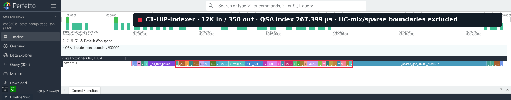
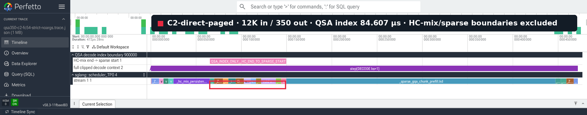

# QSA decode on ROCm

This directory contains the Qwen3.8 QSA indexer and sparse-attention path. On
gfx942/MI308X, the supported decode configuration uses the CUDA implementation
as its semantic reference while replacing CUDA-only kernels with HIP-capable
JIT or Triton kernels.

## Selected decode path

For the validated Qwen configuration (BF16, 12 query heads, one KV head,
head dimension 256, compression ratio 4, and block top-k 512), the GPU path is:

```text
index projection GEMM
-> qsa_index_q_prep_kernel
-> qsa_index_k_compress_kernel
-> _triton_qsa_mqa_decode_kernel.kd
-> fast_topk_kernel<512, false>
-> _expand_qsa_block_indices_kernel.kd
-> _sparse_gqa_chunk_prefill.kd
```

The final sparse-attention kernel is a direct-paged, one-CTA-per-row decode
kernel. It is launched before the generic compact-KV fallback and reads the
full K/V cache through the indexer's existing page table.

## Operator replacements

| Previous work | Current implementation | Notes |
|---|---|---|
| Torch paged-cache gather, FP32 einsum/GEMM, ReLU, head reduction, scaling, and tail masking | `_triton_qsa_mqa_decode_kernel.kd` | Reads compressed K pages directly and produces the MQA logits in one Triton kernel. |
| Allocating/filling a zero `row_starts` tensor before decode FastTopK | `fast_topk(..., row_starts=None)` | Decode rows always start at zero; the FastTopK kernel itself is unchanged. |
| Work on complete logits-tail CTAs | Device-side early return in `_triton_qsa_mqa_decode_kernel.kd` | Internal FastTopK receives the valid compressed lengths, so untouched tail CTAs are not consumed. |
| Valid-count, prefix-sum, compact-KV, and relative-index preparation before sparse attention | Direct logical-index to physical-page mapping inside `_sparse_gqa_chunk_prefill.kd` | The supported path does not materialize a compact K/V buffer. |
| Experimental split-K stage plus merge | One `_sparse_gqa_chunk_prefill.kd` launch | No partial-output, LSE, merge, or effective-length scratch is present in the selected product path. |

The following kernels are retained rather than replaced:

- `qsa_index_q_prep_kernel`: normalizes/rotates the current index query and
  updates the pending index-K ring.
- `qsa_index_k_compress_kernel`: writes a completed four-token compressed key;
  inactive graph rows return through a device-side slot-zero sentinel.
- `fast_topk_kernel<512, false>`: selects 512 compressed blocks.
- `_expand_qsa_block_indices_kernel.kd`: expands each selected compressed block
  to four raw-token indices and appends up to three tokens from the incomplete
  compression group. Its output width is therefore `2048 + 3 = 2051`.

## MQA equivalence

`_triton_qsa_mqa_decode_kernel` and `tilelang_qsa_mqa_decode` implement the
same expression for every visible compressed key:

```text
logit[key] = sum_over_heads(relu(dot(query[head], key))) / sqrt(head_dim)
```

Both read the paged compressed-K cache and mask positions outside the device
context length. The Triton implementation handles the native four query heads
directly; the TileLang implementation pads the head dimension used by its MMA
layout.

The production compressed-K cache is always BF16 and is viewed as
`[physical_pages, 16, 1, 128]`. Page-table entries are full-KV physical page
IDs; the one-to-one full/compressed page numbering lets the scorer resolve a
compressed logical position as:

```text
logical_page = compressed_position // 16
page_offset = compressed_position % 16
physical_page = page_table[row, logical_page]
K = compressed_cache[physical_page, page_offset, 0, :]
```

The Triton kernel explicitly converts both loaded Q and compressed K fragments
to BF16 before `tl.dot`, matching TileLang semantics. Q may therefore be BF16
or FP16 without materializing a Torch cast tensor. GPU-resident page tables and
context lengths may be int32 or int64; Triton promotes loaded values to int64
for address arithmetic, so int64 metadata also avoids a separate cast kernel.
FP8 compressed-K is intentionally unsupported because the current cache has no
quantization-scale metadata and its writer/storage contract is BF16.

The normal test suite uses `torch_qsa_mqa_decode` as the portable numerical
oracle. It covers short rows, page crossings, invalid page IDs, and graph
replay with growing and shrinking context lengths. The accepted tolerance is
`rtol=2e-2, atol=2e-2`; standalone 12K/16K measurements observed maximum
absolute errors between `9.54e-7` and `1.91e-6`.

An optional test also compares Triton directly with TileLang when TileLang is
installed on gfx942. The independent bring-up measurement found identical
finite/negative-infinity masks and maximum absolute error `9.54e-7` in eager
execution and HIP graph replay. On the same MI308X, the complete calls measured
about 14.90 us for Triton and 30.01 us for TileLang, including TileLang's
padding/fill wrappers.

## Tests

The relevant tests are:

- `test_qsa_decode_mqa_prefers_triton_over_tilelang_on_gfx942`
- `test_qsa_decode_mqa_four_heads_gpu`
- `test_qsa_triton_decode_mqa_short_and_cross_page_matches_reference_on_rocm`
- `test_qsa_triton_decode_mqa_casts_inputs_to_bf16_on_rocm`
- `test_qsa_triton_decode_mqa_cast_stays_inside_kernel_on_rocm`
- `test_qsa_triton_decode_mqa_rejects_out_of_range_pages_on_rocm`
- `test_qsa_triton_decode_mqa_supports_rocm_graph_replay`
- `test_qsa_triton_decode_mqa_matches_tilelang_when_available`
- `test_qsa_same_named_chunk_prefill_kernels_do_not_collide_in_one_process`
- `test_qsa_fast_topk_expand_dispatches_direct_paged_one_cta`
- `test_qsa_backend_direct_paged_one_cta_graph_replay`
- `test_qsa_backend_direct_paged_one_cta_two_layers_do_not_alias`

The direct-paged backend tests make the compact-KV helpers fail if they are
reached, compare outputs with an FP32 reference, and inspect profiler events to
require `_sparse_gqa_chunk_prefill.kd` while rejecting split-K or merge names.

## 12K input / 350 output validation

This commit was compared with its HIP-indexer parent on the same `gpufc54`
MI308X pair using ROCm 7.2.4, TP2, concurrency 1, four fixed-seed requests,
fresh compiler caches, and Triton linear-attention prefill/decode/verify
backends. Every request had exactly 12,000 input tokens and generated exactly
350 output tokens.

| Metric | Before | After | Change |
|---|---:|---:|---:|
| Mean E2E | 7112.896 ms | 6813.604 ms | -4.21% |
| Mean TTFT | 1230.666 ms | 1229.997 ms | -0.05% |
| Mean TPOT | 16.855 ms | 15.999 ms | -5.08% |
| Output throughput | 49.149 tok/s | 51.306 tok/s | +4.39% |
| QSA index, 72-sample mean | 266.530 us/layer | 83.607 us/layer | -68.63% |
| Representative QSA index | 267.399 us | 84.607 us | -68.36% |
| Representative interior kernels | 32 | 11 | -21 launches |

The QSA interval starts at `_hc_mix_persistent_kernel.kd` END and stops at
`_sparse_gqa_chunk_prefill.kd` START; both boundary kernels are excluded. The
representative screenshots use TP0 decode step 2, QSA layer 1. The aggregate
uses both TP ranks, steady steps 2--4, and all 12 QSA layers.

Generated-output SHA-256 is identical before and after:

```text
6f478b160436babb398ddabb413fa1ba782633614399f31bdfb921fa1d032728
```





- [Before in Perfetto](https://ui.perfetto.dev/#!/?url=https%3A%2F%2Fstorage.googleapis.com%2Fperfetto-ui-data%2F7dc269676439f0a62a159f8506213729c7bb4570&visStart=0&visEnd=557315&ts=65179&dur=267399)
- [After in Perfetto](https://ui.perfetto.dev/#!/?url=https%3A%2F%2Fstorage.googleapis.com%2Fperfetto-ui-data%2F929e2233e6e238e15bd6223b4195dca60c4500cd&visStart=0&visEnd=472027&ts=65058&dur=84607)
